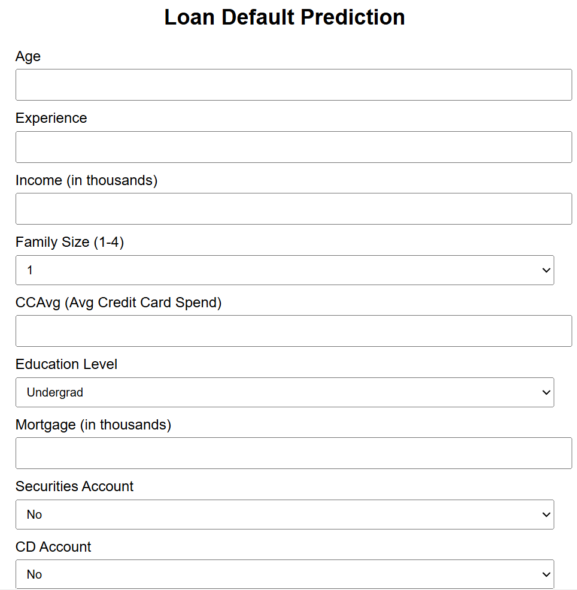
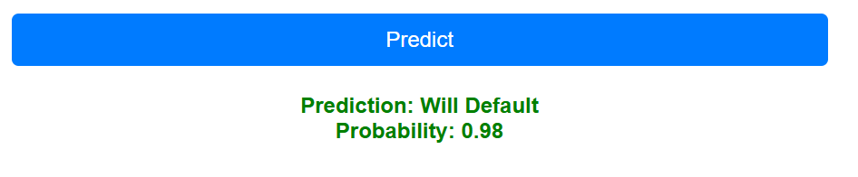
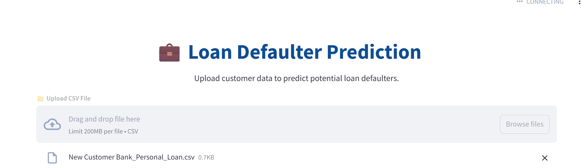
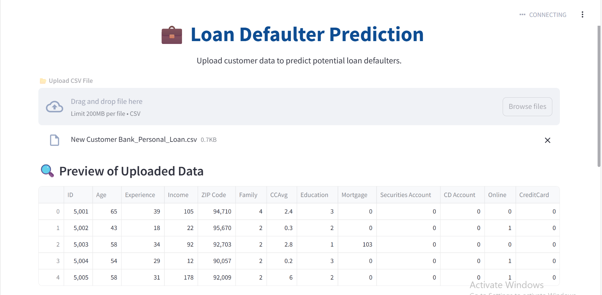
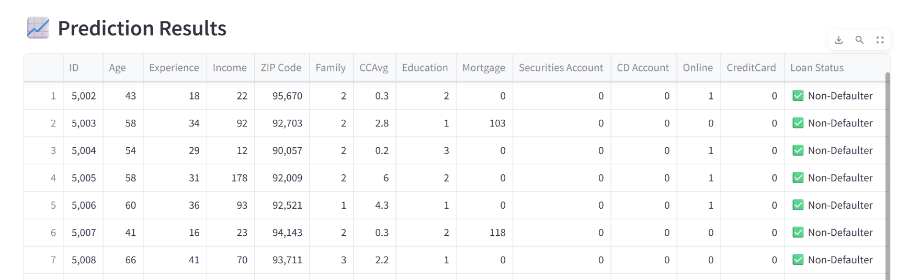

# 💼 Bank Loan Default Prediction System

This project includes both a **Flask application** and a **Streamlit dashboard** to predict whether each customer is a loan defaulter using a pre-trained RandomForest model.

---

## 📈 Bank Loan Default Prediction – Flask App

This Flask application allows users to upload a CSV file and get predictions for each customer.

### ✨ Features

✅ Upload `.csv` file via a web interface  
✅ Backend preprocessing: scaling, encoding, adding missing columns  

✅ Uses `model.pkl`, `scaler.pkl`, and `columns.pkl`  
✅ Returns predictions in an easy-to-read HTML table  




### 📂 Required Files

Place the following files in the **same directory as `app.py`:**

- `model.pkl` – Trained RandomForest model
- `scaler.pkl` – Scaler used during training
- `columns.pkl` – List of features used in training

---

## 📊 Bank Loan Default Prediction – Streamlit Dashboard

An interactive Streamlit dashboard that allows you to upload a `.csv` file and get batch predictions on loan default risk.

### ✨ Features

✅ Upload customer CSV files directly from the UI  

✅ Displays full customer data with prediction results  
✅ Uses pre-trained model and preprocessing  
✅ Fast, simple, and user-friendly layout  



### 📂 Required Files

Ensure these files are in the **same folder as `stream.py`:**

- `model.pkl`
- `scaler.pkl`
- `columns.pkl`

---

## 🚀 How to Run

### Flask App

1️⃣ Install dependencies:
```
pip install -r requirements.txt
```
2️⃣ Start the Flask server:
```
python app.py
```
---

### Streamlit Dashboard

1️⃣ Install dependencies:
```
pip install streamlit pandas scikit-learn
```
2️⃣ Launch Streamlit:
```
streamlit run stream.py
```
3️⃣ The dashboard will open automatically in your browser.

---

✅ **Tip:** Make sure all required `.pkl` files are in place before running either app.

---
